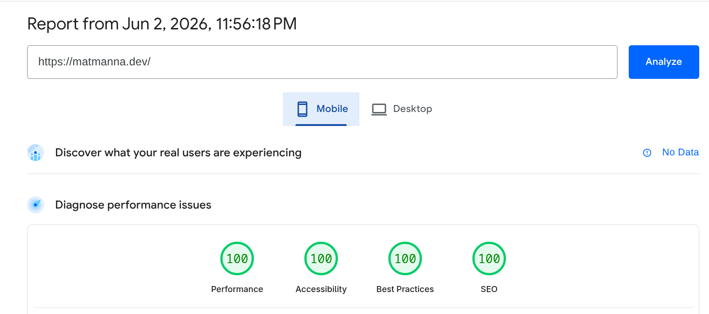

# matmanna.dev

the latest iteration of my personal site, based on the blog theme i made for tonic, [doctored](https://doctored.matmanna.dev). the site aims to be simple, elegant, and above all - small! to accomplish all that, it currently uses jekyll, tailwind, markdown, html/js/css, goatcounter analytics, and hosted on github pages (--> cf asap). all of this allows it to serve as my main "place on the web", an active personal portfolio, and eventual blog as well.

production: https://matmanna.dev

---

**deployment:**


right now deployed on cloudflare pages! still some kinks to work out from github pages but i dont really have time right now lol.


build command: 

```bash
bundle exec jekyll build --baseurl "${{ steps.pages.outputs.base_path }}" && node scripts/post-build.js
```

build directory:
```bash
/_site
```

---

**performance**



---

**site wight**

WIP (~110kB or so)

---

**a11y**

WAVE optimizations coming soon

---

**attribution:**

- [shymike](https://imshymike.dev) for hackatime-heatmap
- all the people who inspired [doctored](https://doctored.matmanna.dev)

i avoided relying on genai for the content/design of the site, but codex was shockingly super helpful for the tailwind compression functions and optimization prototypes!
